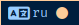
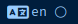

# Script: kbdlayout

Provides current keyboard layout and Caps Lock status.


 

## Dependencies
	xset, grep, awk

## Module

```ini
[module/weather]
type=custom/script
tail=true
interval=0.1
exec="/path/to/script/kbdlayout.sh"
```

